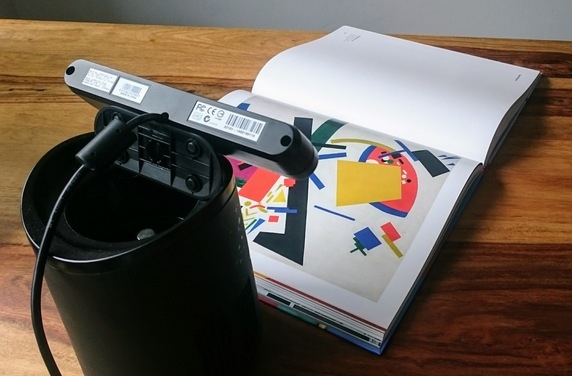

# `calibrate_radiometric_response`

This app allows you to calibrate the radiometric response of the camera. Two
methods are implemented:

* Debevec and Malik (Recovering High Dynamic Range Radiance Maps from Photographs)
* Engel et al. (A Photometrically Calibrated Benchmark For Monocular Visual Odometry)

The first method requires _radical_ to be compiled with _Ceres_ support. If you
do not have _Ceres_ installed on your system (as will often be the case for
Windows users), then you are limited to the second option. In our experience,
the first methods gives better results, so it is recommended to use it when
possible.

To see the list of available command-line options, run
`calibrate_radiometric_response --help`.

## Preparation

Fix the camera in front of a static scene, i.e. a scene without moving objects
and with stable lighting conditions. Note that even slight variations in
lighting during the calibration process may negatively affect the results. Be
especially careful if you scene is lit by a natural light source. For example,
on partly cloudy days the light intensity will fluctuate as the clouds move
through the sky.

During the calibration process the camera will take images at multiple exposure
times, starting from the shortest and ending at the longest. The goal is to
observe all possible intensity values in every color channel. Therefore, choose
the scene such that with the shortest exposure time the image is mostly black
and with the longest exposure time it is very bright. A good choice is to put a
colorful picture in front of the camera (Suprematist art works fairly well).
Here is a possible calibration setup:

## Data collection

After starting the app, a window with the current camera image will pop up. The
app will adjust the white balance and exposure time, and then begin data
capture. The window will also display a histogram of intensity distribution in
the collected dataset:

Once again, it is important that all possible intensities in all color channels
are present in the dataset. Use the histogram to assess the quality of collected
data and strive to get something similar to what is shown above. If some
intensities are missing, choose another scene and re-run the app.

## Response computation

Once the dataset is collected, the app will proceed to compute the radiometric
response for each color channel. The process will be visualized in the window:

Note that above is the visualization for `debevec` method. For `engel` it will
look slightly different.

## Results

After the response curves are computed, they will be saved to a file and
presented for visual evaluation on the screen:

In our experience, the curves should be smooth and very similar between
different color channels. If this is not the case, double-check that there is no
lighting changes during data collection. Also try to change the scene or tweak
app parameters.

## Hints

The app can store the collected dataset if you run it with the `--save` option.
Goes without saying, the app can calibrate radiometric response from a stored
dataset. Leverage this to save time on re-collecting the data if you want to
experiment with different calibration methods and their parameters.
